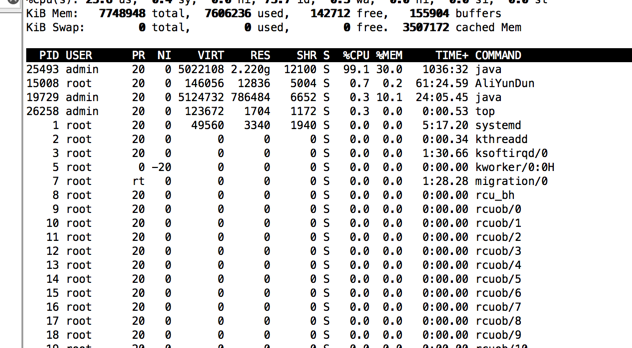
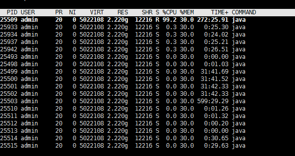
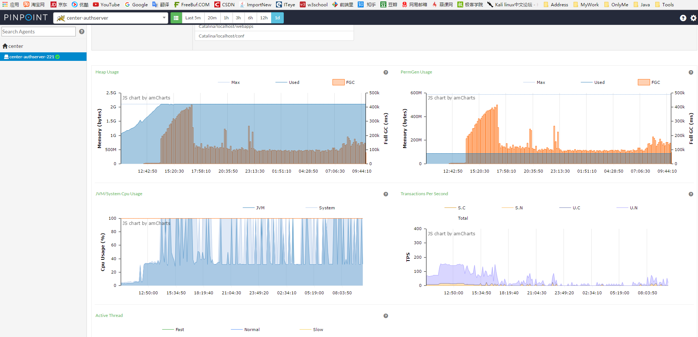
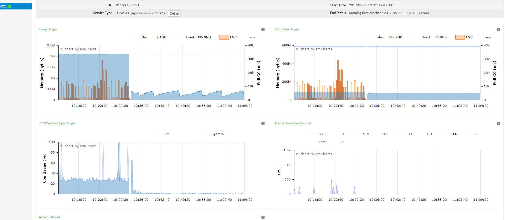
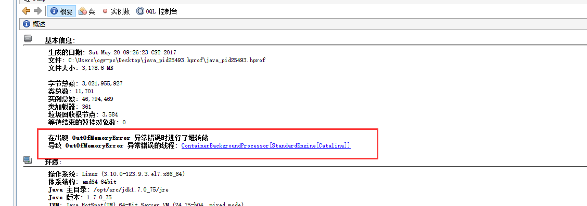
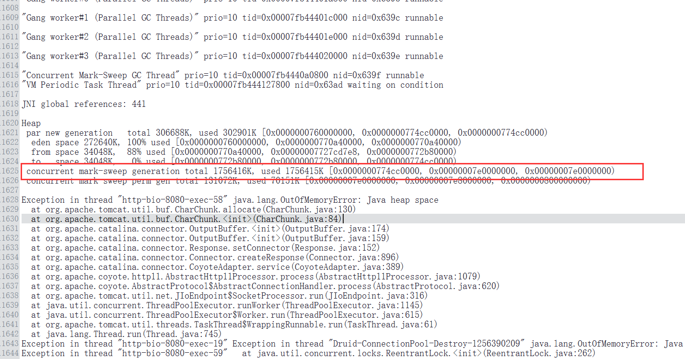
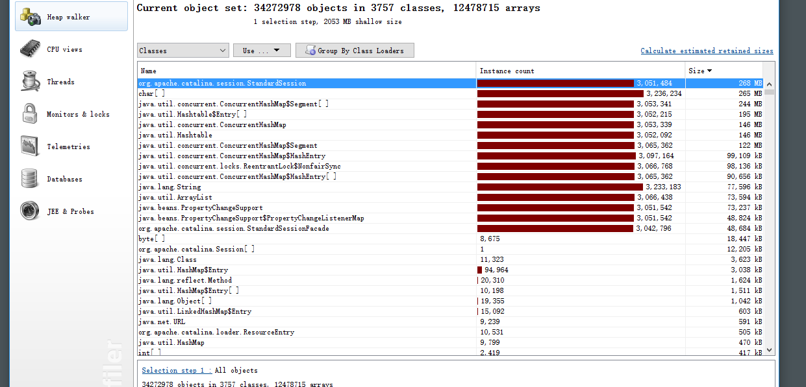

[TOC]

# CPU 100% 问题

---------

## 线上问题处理 CPU 100%  `2017-05-27`

### 背景
由于之前做了个单点登录，导致首次访问子系统都要去验证登录、获取权限，生成seesion，速度慢，用户体验差
故做了个ajax请求，去提前获取session，当时做完自测的时候是有302错误的，没有在意，觉得并不影响，然后直接上线。
结果炸了，2天以后cpu 100%, 如下图， 重启之后正常， 过了1天 又100%。

### 解决过程
执行 `top` 命令， 结果如下
 

执行 `top -H -p25493`
 

执行 `jstack 25493 | grep -A 40 63a5` 发现占用cpu的线程是gc， 初步认定是堆内存爆满

看了下pinpoint 更加直观 如下
 

重启之后 正常
 

jmap 保存快照。
 
VisualVM分析快照 有个OM 错误
 

 

JProfilter分析快照  session 有300W个  惊呆了。。。
 

### 故障原因分析
根据pinpoint，内存上升过程基本在一条直线上，说明session在不停的产生
大概是因为ajax请求之后在无限重定向。
由于这个ajax请求没有携带session的cookie，所以就不停的产生session了。
但是有点很奇怪，自测的时候重定向几次后就不会再重定向了
而线上情况看来是有个请求一直在重定向，难道重定向次数还跟跟浏览器有关？

### 解决方法
代码回滚

### 教训
`不要忽视小错误`
`优化什么的,能推就推了,毕竟能力差`  
